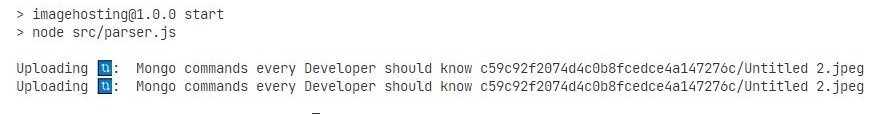

# Markdown Image Hosting

Host all your local markdown image links and use your markdown anywhere.

## Description

You can now use your markdown file directly on any blogging platform 😃 without the hustle of uploading/selecting each image manually 💻.

## Getting Started

### Dependencies

- node

### Installing

Install the app. It will install all your dependencies.

```
npm install
```

- Now make your project on firebase and get the your API-keys from there.
- Make a `.env` file in the project root dir (`imageHosting\.env`).
- And specify the firebase api-keys there

```
# Firebase configration
FIREBASE_API_KEY = ******************
FIREBASE_AUTH_DOMAIN = ******************
FIREBASE_PROJECT_ID = ******************
FIREBASE_STORAGE_BUCKET = ******************
FIREBASE_MESSAGING_SENDER_ID = ******************
FIREBASE_APP_ID = ******************
FIREBASE_MEASUREMENT_ID = ******************
```

Start the app and specify the markdown file in the arguments

```
npm start blog/my-blog.md
```

The parser will parse the markdown files and search for all the images links like ``.

Please note that all the local image links should be correct. It's recommended that both the markdown file and the images should be under same **dir**



Now all the images link will be updated with the new one (hosted one).

## Help

If some error occurred try opening your markdown before hosting to check all images path are correct. Try keeping markdown and images files under same dir and then give the markdown path to the app.

## License

This project is licensed under the [MIT] License - see the LICENSE.md file for details
